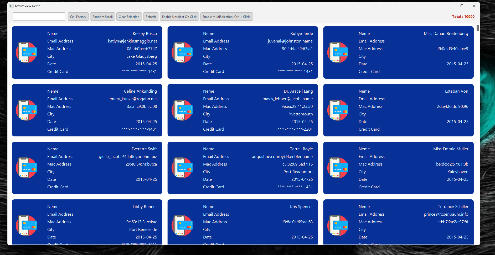

# NfxListView - JavaFX Custom ListView

***

## Overview
`NfxListView` is a custom JavaFX ListView. It includes features like:
- Asynchronous data loading
- Dynamic filtering using a search input
- Custom cell rendering using `CellFactory`
- Selection modes (single/multiple)

## Features
- **Custom Cell Factory:** Uses `NfxCell<?>` for styling and structuring list items.
- **Filtering:** Dynamically filters the list based on user input.
- **Multi-selection Support:** Toggle between single and multiple selection modes.
- **Selection Management:** Allows enabling/disabling unselect on click.

## 📸 Preview

***